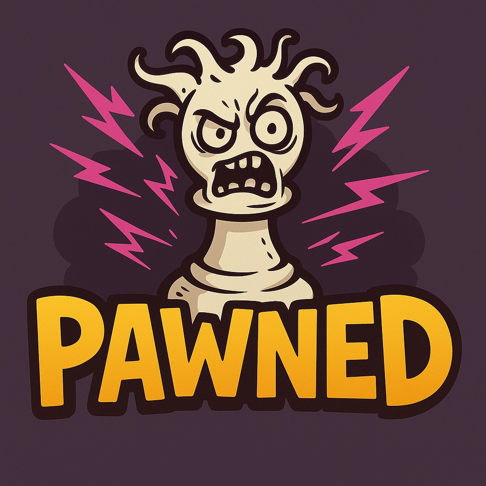
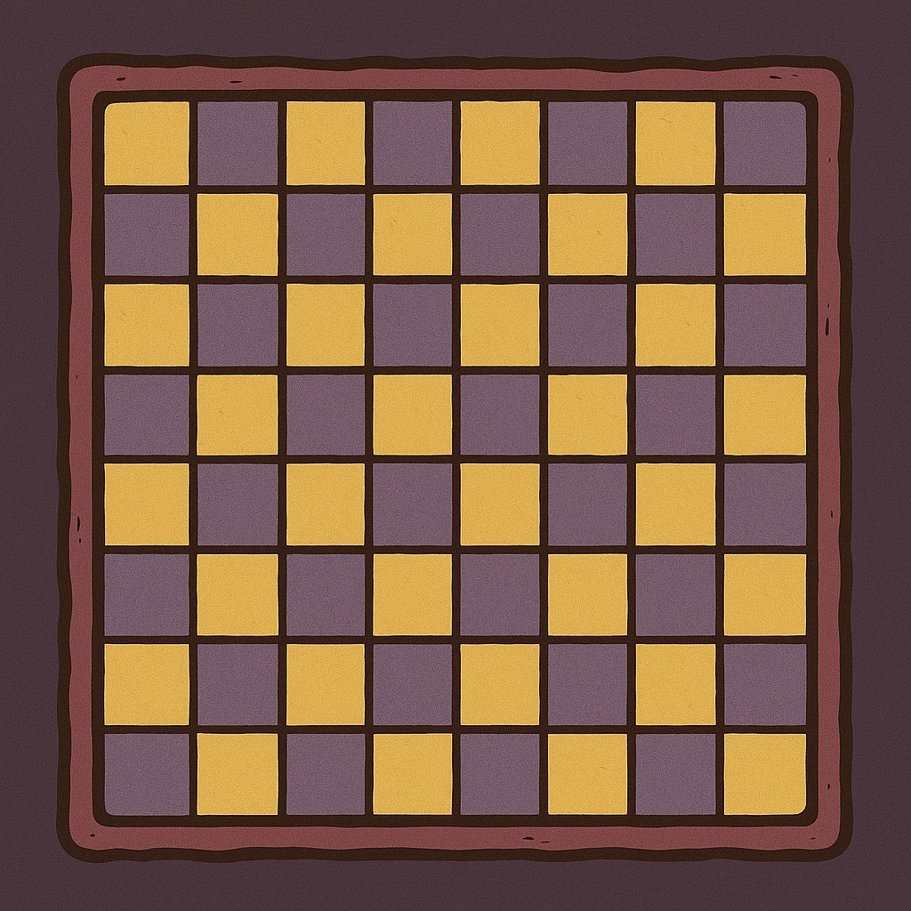
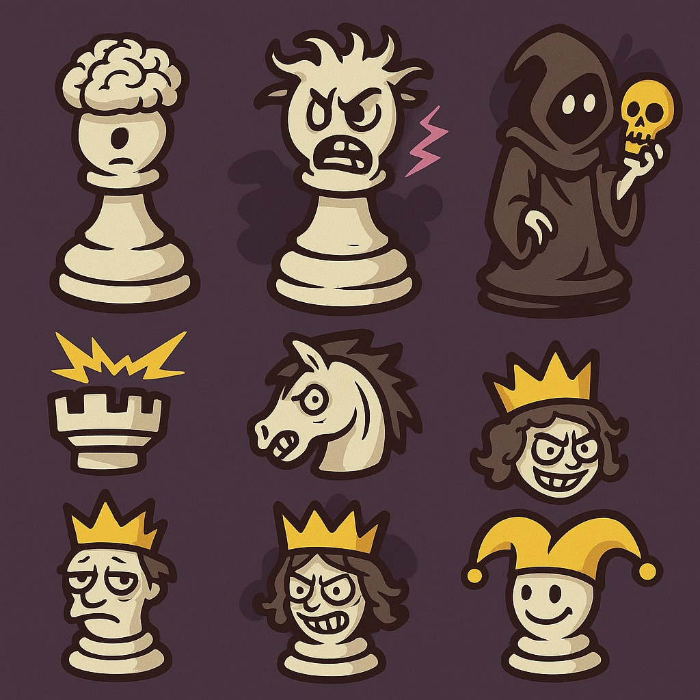

# **Pawned**

## _Game Design Document_

---

##### **Team name:**

ADA

##### **Authors:**

- Miranda Urban Solano A01752391
- Luis Santiago Lopez A01785755
- Luis Leonardo Rodríguez Gálvez A01029331
- Santino Matias Im A01029622

##

## _Index_

---

1. [Index](#index)
2. [Game Design](#game-design)
   1. [Summary](#summary)
   2. [Gameplay](#gameplay)
   3. [Mindset](#mindset)
3. [Technical](#technical)
   1. [Screens](#screens)
   2. [Controls](#controls)
   3. [Mechanics](#mechanics)
4. [Level Design](#level-design)
   1. [Themes](#themes)
      1. Board
         1. Ambient
         2. Interactive
      2. Pieces
         1. Ambient
         2. Interactive
   2. [Game Flow](#game-flow)
5. [Development](#development)
   1. [Abstract Classes](#abstract-classes--components)
   2. [Derived Classes](#derived-classes--component-compositions)
6. [Graphics](#graphics)
   1. [Style Attributes](#style-attributes)
   2. [Graphics Needed](#graphics-needed)
7. [Sounds/Music](#soundsmusic)
   1. [Style Attributes](#style-attributes-1)
   2. [Sounds Needed](#sounds-needed)
   3. [Music Needed](#music-needed)
8. [Schedule](#schedule)

## _Game Design_

---

### **Summary**

This is a chess-roguelike local two player game on which the pieces of the chess board are in mid-game status, which means that the pieces are already developed and ready to attack each other. Each piece capture has a specific amount of points the player should reach to get a completely random powerup. The powerups are triggered by the user so they can use them when most convenient. The game is based on a best-of 3 system so when any of the players reach two wins the run is over.

### **Gameplay**

The gameplay involves the traditional chess moves over the board, until power ups are acquired. The powerups can be general (for every piece of your control) or even be applicable to the opponents pieces. This is the factor of the game that will add uncertainty and a more fresh experience each run. Powerups can affect the board, exchange pieces, disappear pieces, etc.
The goal of the game is to beat the other player and gain points after each capture to be awarded power ups for any-round use and get to the highest score possible.
To overcome the challenges, the player should focus on adaptability, turn management, and long-term planning. When receiveing a powerup, the player should decide on a conservative or aggressive approach, to attack the opposing pieces with the powerup. Overall, success depends on managing resources wisely, and making calculated sacrifices when necessary.

### **Mindset**

The game is intended to provoke a mindset of a frenetic and randomized gameplay, where the only limit is the combination of the powerups and how they are used, and adventurous tension by creating an atmosphere of constantly adapting to unpredictable situations while seeking creative ways to overcome them. However, the unlockable power-ups allow players to feel progressively stronger with each milestone of points reached. This balances the emotions that are provoked through the design.

## _Technical_

---

### **Screens**

1. Title Screen
   1. Options
2. Play
3. Game
   1. Pause
   2. Quit
4. Shop stage
5. End screen
   1. Winning screen
   2. Losing screen

### **Controls**

The player will interact with the game moving pieces by clicking on them, and then selecting a valid square, following traditional chess movement rules. Each time a piece is selected or clicked upon, the squares 

where the piece can move will be lighted up.

The basic trigger events are the following:

- Left click: select/move piece.
- Right click: view piece info (abilities, stats).
- Key I: open inventory (power-ups & tickets).
- Key Esq: Open menu (continue, new run, main menu).

The triggerable in-game events:

- Purchase of upgraded pieces or special tiles during shop phase.
- 

### **Mechanics**

- Classic chess movement.
- Random piece placement at the start of every round. A controlled randomization system must be used to avoid checkmate, etc.
- The scoring system will be determined by capturing specific pieces (Pawn = 1, Queen = 9, etc.).
- The goal is to reach the round’s required point total to unlock the objects of the shop.
- Power-ups can be applied globally or to specific pieces types, depending on the type of power-up chosen.

## _Level Design_

---

_(Note : These sections can safely be skipped if they&#39;re not relevant, or you&#39;d rather go about it another way. For most games, at least one of them should be useful. But I&#39;ll understand if you don&#39;t want to use them. It&#39;ll only hurt my feelings a little bit.)_

### **Themes**

1. Board
   1. Mood
      1. Supernatural, playful, chaotic.
   2. Objects
      1. _Ambient_
         1. Hand-painted look
         2. Fairytale aesthetic
         3. Dim lighting
      2. _Interactive_
         1. Pieces
         2. Tiles
2. Pieces
   1. Mood
      1. Spectral, theatrical, ghostly.
   2. Objects
      1. _Ambient_
         1. Each piece has its own personality
         2. Uncanny touches
         3. Bizarre looks
      2. _Interactive_
         1. King
         2. Queen
         3. Rook
         4. Bishop
         5. Knight
         6. Pawn

### **Game Flow**

1. Randomized board is generated and target score for the round is displayed.
2. Player moves using chess logic.
3. Capture pieces to gain points.
4. Use any power-ups or tickets if available.
5. Once the target score is reached, the shop opens.
6. Player can spend silver nuggets strategically.
7. Next round begins, same logic, but with a new board, harder layout
8. Repeat until defeat or victory.

## _Development_

---

### **Abstract Classes / Components**

1. BasePhysics
   1. BasePlayer
   2. BaseEnemy
   3. BaseObject
2. BaseObstacle
3. BaseInteractable

_(example)_

### **Derived Classes / Component Compositions**

1. BasePlayer
   1. PlayerMain
   2. PlayerUnlockable
2. BaseEnemy
   1. EnemyWolf
   2. EnemyGoblin
   3. EnemyGuard (may drop key)
   4. EnemyGiantRat
   5. EnemyPrisoner
3. BaseObject
   1. ObjectRock (pick-up-able, throwable)
   2. ObjectChest (pick-up-able, throwable, spits gold coins with key)
   3. ObjectGoldCoin (cha-ching!)
   4. ObjectKey (pick-up-able, throwable)
4. BaseObstacle
   1. ObstacleWindow (destroyed with rock)
   2. ObstacleWall
   3. ObstacleGate (watches to see if certain buttons are pressed)
5. BaseInteractable
   1. InteractableButton

_(example)_

## _Graphics_

**Game logo**

**Game board**

**Pieces/Characters**

---

### **Style Attributes**

What kinds of colors will you be using? Do you have a limited palette to work with? A post-processed HSV map/image? Consistency is key for immersion.

What kind of graphic style are you going for? Cartoony? Pixel-y? Cute? How, specifically? Solid, thick outlines with flat hues? Non-black outlines with limited tints/shades? Emphasize smooth curvatures over sharp angles? Describe a set of general rules depicting your style here.

Well-designed feedback, both good (e.g. leveling up) and bad (e.g. being hit), are great for teaching the player how to play through trial and error, instead of scripting a lengthy tutorial. What kind of visual feedback are you going to use to let the player know they&#39;re interacting with something? That they \*can\* interact with something?

### **Graphics Needed**

1. Characters
   1. Human-like
      1. Goblin (idle, walking, throwing)
      2. Guard (idle, walking, stabbing)
      3. Prisoner (walking, running)
   2. Other
      1. Wolf (idle, walking, running)
      2. Giant Rat (idle, scurrying)
2. Blocks
   1. Dirt
   2. Dirt/Grass
   3. Stone Block
   4. Stone Bricks
   5. Tiled Floor
   6. Weathered Stone Block
   7. Weathered Stone Bricks
3. Ambient
   1. Tall Grass
   2. Rodent (idle, scurrying)
   3. Torch
   4. Armored Suit
   5. Chains (matching Weathered Stone Bricks)
   6. Blood stains (matching Weathered Stone Bricks)
4. Other
   1. Chest
   2. Door (matching Stone Bricks)
   3. Gate
   4. Button (matching Weathered Stone Bricks)

_(example)_

## _Sounds/Music_

---

### **Style Attributes**

Again, consistency is key. Define that consistency here. What kind of instruments do you want to use in your music? Any particular tempo, key? Influences, genre? Mood?

Stylistically, what kind of sound effects are you looking for? Do you want to exaggerate actions with lengthy, cartoony sounds (e.g. mario&#39;s jump), or use just enough to let the player know something happened (e.g. mega man&#39;s landing)? Going for realism? You can use the music style as a bit of a reference too.

Remember, auditory feedback should stand out from the music and other sound effects so the player hears it well. Volume, panning, and frequency/pitch are all important aspects to consider in both music _and_ sounds - so plan accordingly!

### **Sounds Needed**

1. Effects
   1. Soft Footsteps (dirt floor)
   2. Sharper Footsteps (stone floor)
   3. Soft Landing (low vertical velocity)
   4. Hard Landing (high vertical velocity)
   5. Glass Breaking
   6. Chest Opening
   7. Door Opening
2. Feedback
   1. Relieved &quot;Ahhhh!&quot; (health)
   2. Shocked &quot;Ooomph!&quot; (attacked)
   3. Happy chime (extra life)
   4. Sad chime (died)

_(example)_

### **Music Needed**

1. Slow-paced, nerve-racking &quot;forest&quot; track
2. Exciting &quot;castle&quot; track
3. Creepy, slow &quot;dungeon&quot; track
4. Happy ending credits track
5. Rick Astley&#39;s hit #1 single &quot;Never Gonna Give You Up&quot;

_(example)_

## _Schedule_

---

_(define the main activities and the expected dates when they should be finished. This is only a reference, and can change as the project is developed)_

1. develop base classes
   1. base entity
      1. base player
      2. base enemy
      3. base block
2. base app state
   1. game world
   2. menu world
3. develop player and basic block classes
   1. physics / collisions
4. find some smooth controls/physics
5. develop other derived classes
   1. blocks
      1. moving
      2. falling
      3. breaking
      4. cloud
   2. enemies
      1. soldier
      2. rat
      3. etc.
6. design levels
   1. introduce motion/jumping
   2. introduce throwing
   3. mind the pacing, let the player play between lessons
7. design sounds
8. design music

_(example)_
