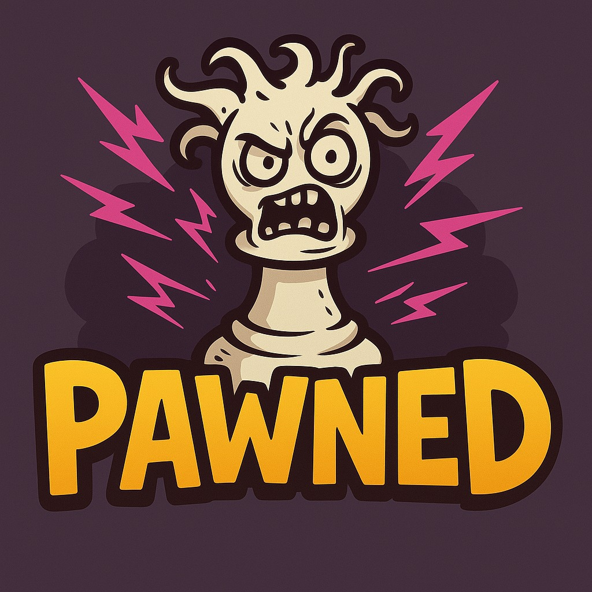
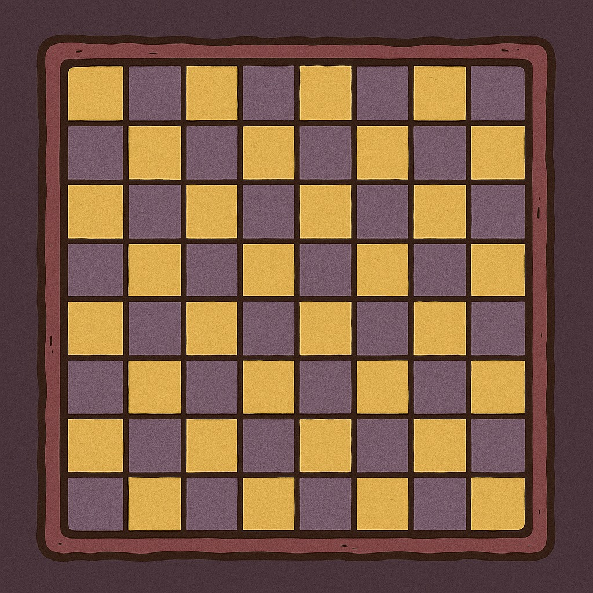
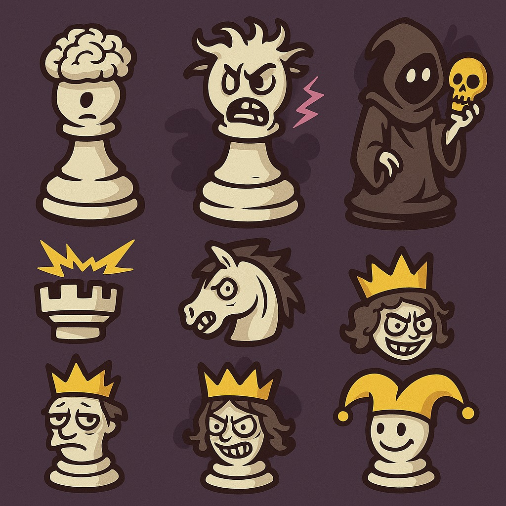

# **Pawned**

  

## _Game Design Document_

  

##### **Team name:**

ADA

##### **Authors:**

- Miranda Urban Solano A01752391
- Luis Santiago Lopez A01785755
- Luis Leonardo Rodríguez Gálvez A01029331
- Santino Matias Im A01029622

## _Index_

---

1. [Index](#index)
2. [Game Design](#game-design)
   1. [Summary](#summary)
   2. [Gameplay](#gameplay)
   3. [Mindset](#mindset)
3. [Technical](#technical)
   1. [Screens](#screens)
   2. [Controls](#controls)
   3. [Mechanics](#mechanics)
4. [Level Design](#level-design)
   1. [Themes](#themes)
      1. Board
         1. Ambient
         2. Interactive
      2. Pieces
         1. Ambient
         2. Interactive
   2. [Game Flow](#game-flow)
5. [Development](#development)
   1. [Abstract Classes](#abstract-classes--components)
   2. [Derived Classes](#derived-classes--component-compositions)
6. [Graphics](#graphics)
   1. [Style Attributes](#style-attributes)
   2. [Graphics Needed](#graphics-needed)
7. [Sounds/Music](#soundsmusic)
   1. [Style Attributes](#style-attributes-1)
   2. [Sounds Needed](#sounds-needed)
   3. [Music Needed](#music-needed)
8. [Schedule](#schedule)

## _Game Design_

---

### **Summary**

This is a chess-roguelike local two player game on which the pieces of the chess board are in mid-game status, which means that the pieces are already developed and ready to attack each other. Each piece capture has a specific amount of points the player should reach to get a completely random powerup. The powerups are triggered by the user so they can use them when most convenient. The game is based on a best-of 3 system so when any of the players reach two wins the run is over.

### **Gameplay**

The gameplay involves the traditional chess moves over the board, until power-ups are acquired. The power-ups can be general (for every piece under your control) or even applicable to the opponent’s pieces. This is the factor of the game that will add uncertainty and a more fresh experience each run. Power-ups can affect the board, exchange pieces, make pieces disappear, etc. While the chess pieces are randomly reassigned each round, the power-ups and points you’ve acquired persist, allowing strategic progression and build variety across the run.

The board itself is randomly obtained from a pool of different mid-game scenarios (neutral, favorable to player 1 pr favorable to player 2) at the beginning of each round or game, using a curated set of mid-game chess positions as templates. This ensures a variety of dynamic and challenging starting situations, while maintaining balanced and recognizable chess structures.

The goal of the game is to capture the opponent’s king, as in traditional chess, while gaining points after each capture to be awarded power-ups for any-round use and reach the highest. To overcome the challenges, the player should focus on adaptability, turn management, and long-term planning. When receiving a power-up, the player should decide on a conservative or aggressive approach to attack the opposing pieces. Overall, success depends on managing resources wisely and making calculated sacrifices when necessary.

### **Mindset**

The game is intended to provoke a mindset of a frenetic and randomized gameplay, where the only limit is the combination of the powerups and how they are used, and adventurous tension by creating an atmosphere of constantly adapting to unpredictable situations while seeking creative ways to overcome them. However, the unlockable power-ups allow players to feel progressively stronger with each milestone of points reached. This balances the emotions that are provoked through the design.

## _Technical_

---

### **Screens**

1. Title Screen
   1. Options
2. Play
3. Game
   1. Pause
   2. Quit
4. Powerup award (when the score is reached)
5. End screen
   1. Winning screen
   2. Losing screen

### **Controls**

The player will interact with the game moving pieces by clicking on them, and then selecting a valid square, following traditional chess movement rules. Each time a piece is selected or clicked upon, the squares where the piece can move will be lighted up.

The basic trigger events are the following:

- Left click: select/move piece.
- Right click: view piece info (abilities, stats).
- Key Esq: Open menu (continue, new run, main menu).

The triggerable in-game events:

- Power-up spawn: select a power-up to apply it to a single piece.

### **Mechanics**

- _Standard Chess Moves:_ click to select a piece, then click a highlighted legal square to move or capture.
- _Scoring:_ capture value = classic chess points (Pawn = 2, Knight/Bishop = 4, Rook = 6, Queen = 9; checkmate grants +12).
- _Power-Up Unlocks:_ Power-ups are unlocked by reaching specific point thresholds during a round. For example, the first power-up is granted at 5 points, the second at 10, and so on. Upon crossing each threshold, the player is awarded a random power-up and it is added to their inventory. The powerups can be accumulated through rounds if they're not used, and each player has a limit of 5 powerups at the same time on inventory (when the number is reached no more powerups can appear for the player).
- Types_Of_Power-Ups: There are three types of powerups:
  1. Piece powerups: Work by changing piece placements, piece swaps, etc.
  2. Board powerups: Work by changing the nature and accesibility of the board.
  3. Movement powerups: Work by changing the movement range of a piece.
- _Power-Up_Use:_ On your turn, you can activate a power-up instead of making a traditional move, or as an enhancement to a move (depending on the power-up type). Click to select the power-up, then click on the target (a piece, square, or zone) to apply its effect.
- _Available Power-Ups:_
  1. Piece powerups
  - Shield: Temporarily protects a piece from capture for one turn.
  - Blast: Destroys a selected enemy piece instantly (just for pawn, knight and bishop).
  - Swap: Swap positions of any two of your pieces on the board. You'll lose your turn by using it.
  - Extra move: Grants an immediate second move within the same turn (different pieces).
  2. Board powerups
  - Fence: Lock a tile for three turns.
  - Horizontal portal: Allows a piece to move from one end of the board to the other one (just for rook and queen).
  - Cage: Immobilizes the piece for three turns.
  - Evolution: Allows you to select a random tile, if a pawn falls there it transforms in a knight or bishop.
  3. Movement powerups
  - Pawn range: Changes the range of movement of the pawn. Moves two tiles, instead of moving one tile.
  - Reducer: Reduces the range of motion of a piece (just for knight, bishop and queen).
  - Crazy king: Change the king's range of movement to act as queen for three turns.
- _Two Rounds:_
  1. _Round 1:_ standard mid‑game setup—race for points and powers.
  2. _Round 2:_ fresh mid‑game layout where the trailing player receives an _advantaged formation_:
     - +2 advanced pawns on the third rank,
     - +1 additional minor piece (Knight or Bishop) placed to control the center,
     - +1 free superpower token in inventory at start.
- _Victory:_ highest cumulative points after Round 2; if tied, next capture wins.
- Post_Game: After each game a random powerup that wasnt unlocked before will be available to use and spawn in the next matches.

## _Level Design_

### **Themes**

1. Board
   1. Mood
      1. Supernatural, playful, chaotic.
   2. Objects
      1. _Ambient_
         1. Hand-painted look
         2. Fairytale aesthetic
         3. Dim lighting
      2. _Interactive_
         1. Pieces
         2. Tiles
2. Pieces
   1. Mood
      1. Spectral, theatrical, ghostly.
   2. Objects
      1. _Ambient_
         1. Each piece has its own personality
         2. Uncanny touches
         3. Bizarre looks
      2. _Interactive_
         1. King
         2. Queen
         3. Rook
         4. Bishop
         5. Knight
         6. Pawn

### **Game Flow**

1. A standard mid‑game layout is generated randomly and the target score for the round is displayed.
2. Player moves using chess logic.
3. Capture pieces to gain points.
4. According to the points gained, power-ups are displayed.
5. Use any power-ups if available.
6. Next round begins, same logic, but with a new board, applying dynamic layout favoring trailing players (advanced pawns, central minor piece, bonus power).
7. Repeat until victory or sudden‑death.

## _Development_

---

### **Abstract Classes / Components**

1. ⁠*GameManager:* orchestrates rounds, scores, transitions
2. ⁠*Board:* handles grid, piece placement, power spawn logic
3. _Player:_ input, score tracking, power inventory
4. _Piece:_ movement rules, capture handling
5. _PowerUp:_ interface for spawning & activation effects

### **Derived Classes / Component Compositions**

1. _Piece:_ Pawn, Knight, Bishop, Rook, Queen, King
2. _PowerUp:_

- _ExtraMove:_ immediate extra turn
- _Swap:_ exchange two pieces anywhere
- _Shield:_ protect one piece from next capture
- _Teleport:_ relocate one piece to any empty square
- _Blast:_ remove any enemy piece of your choice

3. _Board Generators:_ StandardSetupGenerator, HandicapSetupGenerator

## _Graphics_

**Game logo**

**Game board**

**Pieces/Characters**

---

### **Style Attributes**

- ⁠*Art Style:* playful, cartoon‑vector with thick black outlines and simple shapes.
- _Palette:_
  - _Backgrounds:_ muted purples and dark browns for contrast.
  - _Tiles:_ alternating pastel gold and lavender reminiscent of “Plants vs. Zombies.”
  - _Pieces & Powers:_ off‑white bases with magenta, yellow, and teal accents for visual pop.
- _Aesthetic Cues:_
  - Slight texture/noise overlay for a hand‑drawn feel.
  - Exaggerated expressions on face‑like pieces, dynamic lightning bolts or sparkles on spawns.
- ⁠*Feedback:*
  - _Spawn:_ bright magenta spark and small particles.
  - _Collect:_ quick scaling “pop” and inventory flash.
  - _Activation:_ radial wipe or burst of colored light.

### **Graphics Needed**

1. Characters
   1. Pieces
      1. Pawn
      2. Knight
      3. Bishop
      4. Rook
      5. Queen
      6. King
2. Board
   1. Wood frame
   2. Two tile variants
   3. Highlight overlay
3. Power-ups
   1. ExtraMove
   2. Swap
   3. Shield
   4. Teleport
   5. Blast
4. UI Elements
   1. Panels
   2. Buttons
   3. Tooltips
5. Effects
   1. Spawn sparkle
   2. Capture “bite”
   3. Power activation burst

## _Sounds/Music_

---

### **Style Attributes**

- _Effects:_ whimsical and percussive—light “clicks,” playful “pops,” energetic “zaps.”
- _Music:_ upbeat, loopable tracks with quirky melodies (e.g. marimba, xylophone, light synth), rising in intensity as power thresholds approach.

### **Sounds Needed**

1. Move click
2. Capture bite
3. Power spawn zap
4. Power collect pop
5. Power activate whoosh
6. Round transition jingle
7. Victory/death fanfare

### **Music Needed**

1. _Main Loop:_ light, catchy motif
2. _Tension Build:_ rhythmic swell on spawns
3. _Finale:_ triumphant brass/synth flourish

## _Schedule_

---

### Semana 1

- [ ] Grid & piece movement
- [ ] Highlights
- [ ] Capture scoring
- [ ] UI

### Semana 2

- [ ] Threshold detection
- [ ] Power spawn
- [ ] Implement each power effect

### Semana 3

- [ ] Round transitions
- [ ] Round summaries
- [ ] Handicap layout (favor trailing player in Round 2)

### Semana 4

- [ ] Integrate final graphics
- [ ] Animations
- [ ] Add SFX & music

### Semana 5

- [ ] Playtesting
- [ ] Balancing

### Semana 6

- [ ] Polish
- [ ] Bug fixes

### Semana 7

- [ ] Final build
- [ ] Extra QA if needed
- [ ] Buffer for unexpected issues
