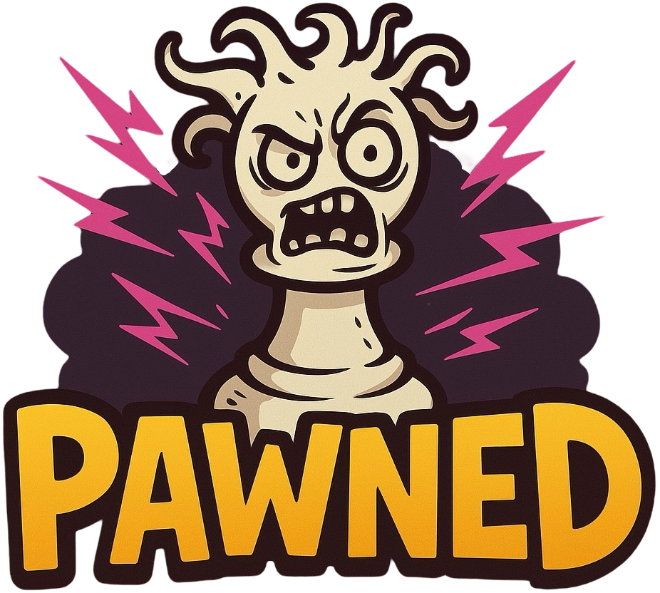

# 🏆 PAWNED - Ajedrez en esteroides


*Logo del juego PAWNED*

---

## 👥 Equipo de Desarrollo

| Miembro | Rol | Contacto |
|---------|-----|----------|
| Pawned Team | Desarrollador Principal
| Leonardo Rodríguez | Diseñador UI/UX 
| Miranda Urban | Desarrollador de DB 
| Santino Im | Desarrollador Backend 


---

## 🎯 Contexto del Juego

**PAWNED** es una versión revolucionaria del ajedrez clásico que combina la estrategia milenaria con elementos modernos del género roguelite. En este universo, los jugadores no solo deben dominar las reglas tradicionales del ajedrez, sino también gestionar estratégicamente una variedad de powerups que pueden cambiar el curso de la partida en cualquier momento.

El juego mantiene la esencia táctica del ajedrez tradicional mientras introduce mecánicas innovadoras que requieren adaptabilidad y pensamiento estratégico avanzado. Cada partida se convierte en una experiencia única donde la planificación clásica se encuentra con la emoción de lo inesperado.

---

## 🎮 Jugabilidad

### Mecánicas Principales

- **Ajedrez Clásico**: Todas las reglas tradicionales del ajedrez se mantienen como base
- **Sistema de Powerups**: Habilidades especiales que se pueden activar durante el juego
- **Rondas Dinámicas**: Las partidas se dividen en rondas con objetivos específicos
- **Ventajas Estratégicas**: Sistema de bonificaciones que premian el juego inteligente
- **Estadísticas en Tiempo Real**: Seguimiento detallado del rendimiento del jugador

### Flujo de Juego

1. **Preparación**: Los jugadores se registran y configuran su perfil
2. **Inicio de Partida**: Se crea una nueva partida entre dos jugadores
3. **Desarrollo**: Turnos alternados con posibilidad de usar powerups
4. **Resolución**: Victoria por jaque mate o captura del rey
5. **Estadísticas**: Registro automático de todos los datos de la partida

---

## 🕹️ Controles

### Controles Básicos

| Acción | Control | Descripción |
|--------|---------|-------------|
| **Seleccionar Pieza** | Click Izquierdo | Selecciona una pieza del tablero |
| **Confirmar Movimiento** | Click en Destino | Confirma el movimiento de la pieza |
| **Cancelar Selección** | Click en Espacio Vacío | Deselecciona la pieza actual |
| **Menu de pausa** | Tecla esc | Redirige hacia menu de pausa |

### Controles de Powerups

| Acción | Control | Descripción |
|--------|---------|-------------|
| **Activar Powerup** | Click en Powerup | Activa el powerup seleccionado |

---

## 📖 Cómo Jugar

1. Clonar repositorio de github
2. Dirigirse a la ubicación del repositorio en terminal y hacer npm install en la carpeta de servidor
3. Desde la carpeta servidor correr servidor con: ```npm run dev```
4. Abrir navegador compatible con JavaScript (Chrome preferentemente)
5. Entrar a la ruta http://localhost:3000 en el navegador
6. Al entrar en el juego, registrarse en User Settings
7. Al ya tener al menos dos usuarios registrados (juego local), se podrá iniciar una partida en start game.
 

---

## ⚙️ Funcionalidades Clave

### 🎲 Sistema de Powerups
- **Powerups Únicos**: Cada powerup tiene efectos específicos y estratégicos
- **Gestión Inteligente**: Los powerups deben usarse en el momento adecuado
- **Estadísticas de Uso**: Seguimiento de popularidad y efectividad

### 📊 Sistema de Estadísticas Avanzado
- **Perfil de Jugador**: Estadísticas completas de rendimiento
- **Historial de Partidas**: Registro detallado de todas las partidas jugadas
- **Análisis de Rendimiento**: Métricas de piezas capturadas y tiempo de juego
- **Rankings**: Sistema de clasificación basado en victorías y puntajes

### 🔄 Gestión de Partidas Completa
- **Partidas en Tiempo Real**: Juego sincronizado entre jugadores
- **Sistema de Rondas**: División estratégica de las partidas
- **Recuperación de Partidas**: Posibilidad de continuar partidas interrumpidas
- **Replay**: Revisión completa de partidas anteriores

### 🛡️ Sistema de Usuarios Robusto
- **Autenticación Segura**: Login y registro con validación
- **Perfiles Personalizables**: Gestión completa de información de usuario
- **Historial Persistente**: Conservación de todo el progreso del jugador

### 🎯 Mecánicas de Juego Innovadoras
- **Turnos Cronometrados**: Control del tiempo por movimiento
- **Capturas Estratégicas**: Sistema avanzado de captura de piezas
- **Protección de Piezas**: Mecánica especial de protección temporal
- **Ventajas Dinámicas**: Bonificaciones que cambian el equilibrio del juego

### 💾 Base de Datos Integral
- **Vistas Especializadas**: Consultas optimizadas para diferentes aspectos del juego
- **Estadísticas en Tiempo Real**: Cálculos automáticos de rendimiento
- **Integridad de Datos**: Validación completa de toda la información del juego

---

## 📋 Documentación de API

### 👤 VISTA_ESTADISTICAS_JUGADOR

| Método | Endpoint | Descripción | Parámetros |
|--------|----------|-------------|------------|
| `GET` | `/api/playerstats` | Obtener estadísticas de jugadores | `?email_jugador=email` (opcional) |
| `POST` | `/api/playerstats` | Registrar nuevo jugador | `body: {email, password}` |
| `POST` | `/api/playerstats/login` | Iniciar sesión | `body: {email, password}` |
| `PATCH` | `/api/playerstats/:email` | Actualizar datos de jugador | `body: {oldPassword, newEmail?, newPassword?}` |

### 🎮 VISTA_RESUMEN_PARTIDA

| Método | Endpoint | Descripción | Parámetros |
|--------|----------|-------------|------------|
| `GET` | `/api/games` | Obtener resumen de partidas | `?id_partida=id&jugador_email=email` (opcionales) |
| `POST` | `/api/games` | Crear nueva partida | `body: {id_jugador1, id_jugador2, ganador_id?, duracion?}` |
| `PATCH` | `/api/games/:id` | Actualizar partida | `body: {ganador_id?, duracion?, fecha_fin?}` |
| `PATCH` | `/api/games/:id_partida` | Finalizar partida | `body: {ganador_id, fecha_fin?, duracion?}` |
| `POST` | `/api/games/:id_partida/stats` | Crear estadísticas de partida | Sin parámetros adicionales |

### ⚡ VISTA_POWERUPS_POPULARES

| Método | Endpoint | Descripción | Parámetros |
|--------|----------|-------------|------------|
| `GET` | `/api/powerups` | Obtener powerups populares | `?nombre_powerup=name&min_usos=number` (opcionales) |
| `POST` | `/api/powerups` | Crear nuevo powerup | `body: {nombre, descripcion?}` |
| `PATCH` | `/api/powerups/:id` | Actualizar powerup | `body: {nombre?, descripcion?}` |
| `POST` | `/api/powerups/use` | Registrar uso de powerup | `body: {id_jugador, id_powerup, id_partida, id_ronda}` |
| `GET` | `/api/powerups/usage/:id_uso` | Verificar uso específico (DEBUG) | Sin parámetros adicionales |
| `GET` | `/api/powerups/usage` | Obtener todos los usos (DEBUG) | Sin parámetros adicionales |

### 🔄 VISTA_ESTADISTICAS_RONDA

| Método | Endpoint | Descripción | Parámetros |
|--------|----------|-------------|------------|
| `GET` | `/api/rounds/stats` | Obtener estadísticas de ronda | `?id_jugador=id&email_jugador=email&min_rondas=number` (opcionales) |
| `POST` | `/api/rounds` | Crear nueva ronda | `body: {id_partida, ganador_id?, numero_ronda, ventaja_aplicada?}` |
| `PATCH` | `/api/rounds/stats/:id_jugador/:id_ronda` | Actualizar estadísticas de ronda | `body: {piezas_capturadas?, piezas_perdidas?, powerups_usados?, turnos_tomados?}` |
| `PATCH` | `/api/rounds/:id_ronda/winner` | Actualizar ganador de ronda | `body: {ganador_id}` |

### 🏁 VISTA_PARTIDAS_COMPLETA

| Método | Endpoint | Descripción | Parámetros |
|--------|----------|-------------|------------|
| `GET` | `/api/games/complete` | Obtener partidas completas | `?id_partida=id&jugador_email=email&estado_partida=estado&fecha_desde=date&fecha_hasta=date` (opcionales) |
| `POST` | `/api/games/complete` | Crear partida completa | `body: {id_jugador1, id_jugador2, duracion_estimada?}` |
| `PATCH` | `/api/games/complete/:id` | Actualizar partida completa | `body: {ganador_id?, duracion_final?, fecha_fin?}` |

### 🎯 VISTA_TURNOS_COMPLETA

| Método | Endpoint | Descripción | Parámetros |
|--------|----------|-------------|------------|
| `GET` | `/api/turns/complete` | Obtener turnos completos | `?id_turno=id&id_ronda=id&id_jugador=id&tipo_pieza=tipo&posicion_desde=pos&posicion_hasta=pos&fue_captura=bool` (opcionales) |
| `POST` | `/api/turns/complete` | Crear nuevo turno | `body: {id_ronda, id_jugador, id_pieza, numero_turno, posicion_desde, posicion_hasta, fue_captura?, tiempo_duracion?}` |
| `PATCH` | `/api/turns/complete/:id` | Actualizar turno | `body: {posicion_desde?, posicion_hasta?, fue_captura?, tiempo_duracion?}` |

### ♟️ VISTA_PIEZAS_COMPLETA

| Método | Endpoint | Descripción | Parámetros |
|--------|----------|-------------|------------|
| `GET` | `/api/pieces/complete` | Obtener piezas completas | `?id_pieza=id&id_jugador=id&id_partida=id&jugador_email=email&tipo_pieza=tipo&color=color&capturada=bool&protegida=bool` (opcionales) |
| `POST` | `/api/pieces/complete` | Crear nueva pieza | `body: {tipo, color, posicion_inicial, id_jugador, id_partida, capturada?, protegida?}` |

### 📊 Códigos de Respuesta HTTP

| Código | Descripción |
|--------|-------------|
| `200` | Operación exitosa |
| `201` | Recurso creado exitosamente |
| `400` | Solicitud incorrecta (datos inválidos) |
| `401` | No autorizado (credenciales inválidas) |
| `404` | Recurso no encontrado |
| `409` | Conflicto (recurso ya existe) |
| `500` | Error interno del servidor |
| `503` | Servicio no disponible (error de DB) |

### 📝 Ejemplos de Uso

#### Registrar nuevo jugador
```bash
POST /api/playerstats
Content-Type: application/json

{
  "email": "jugador@email.com",
  "password": "mipassword123"
}
```

#### Crear nueva partida
```bash
POST /api/games
Content-Type: application/json

{
  "id_jugador1": 1,
  "id_jugador2": 2
}
```

#### Usar powerup
```bash
POST /api/powerups/use
Content-Type: application/json

{
  "id_jugador": 1,
  "id_powerup": 3,
  "id_partida": 5,
  "id_ronda": 2
}
```

---

## 🚀 Tecnologías Utilizadas

- **Frontend**: HTML5, CSS3, JavaScript
- **Backend**: Node.js, Express.js
- **Base de Datos**: MySQL
- **Servidor**: Express Server con API RESTful

---

*¡Que comience la batalla en el tablero! ♔♕*
